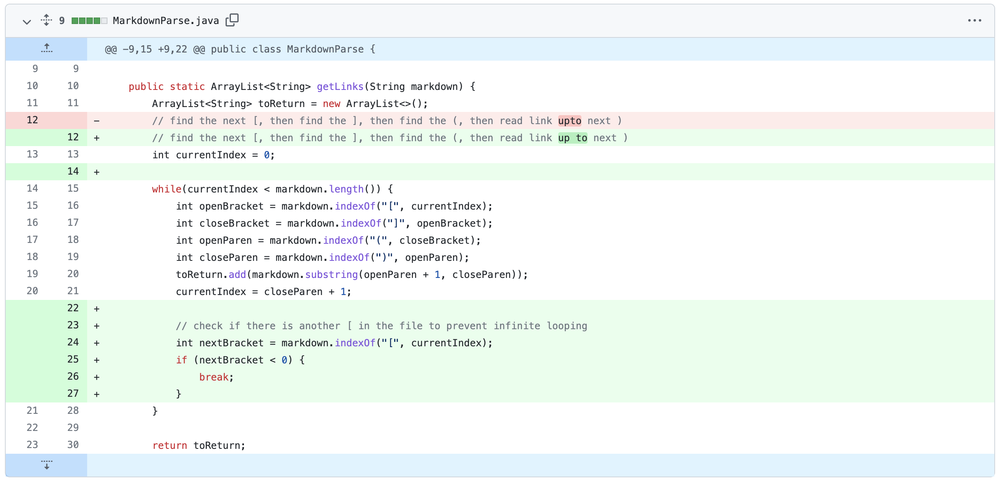
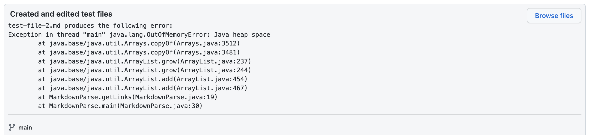
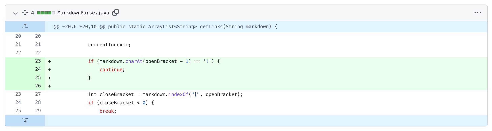
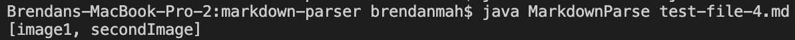
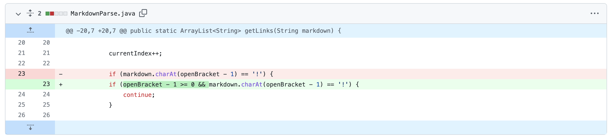
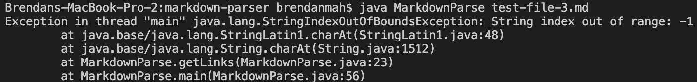

# Lab Report 2

## Bug 1: Infinite Looping
### Code Change:

### Symptom:

[Failure-Inducing Test File: `test-file-2.md`](https://github.com/brendan887/markdown-parser/blob/main/test-file-2.md?plain=1)

The symptom shows that the heap has run out of available memory. This is likely caused by an infinite loop. The only loop in the parser is the while loop that looks for brackets and parenthesis. During the debugging process, it was found that the bug is an infinite loop that occurs if there are additional characters/spaces after the right parenthesis of the last link. `test-file-2.md` tests this because it has an additional right parenthesis and a new line after the last link. Thus, the symptom arises.

## Bug 2: Reads Images as Links
### Code Change:

[Failure-Inducing Test File: `test-file-4.md`](https://github.com/brendan887/markdown-parser/blob/main/test-file-4.md?plain=1)

### Symptom:

`test-file-4.md` has two images instead of links. The symptom that is shown above is that the images are read as links and are included in the links array. The bug is bug is that checking for exclamation marks before right brackets was not yet implemented, resulting in images incorrectly considered as links.

## Bug 3: StringIndexOutofBounds Exception Thrown
### Code Change:

[Failure-Inducing Test File: `test-file-3.md`](https://github.com/brendan887/markdown-parser/blob/main/test-file-3.md?plain=1)

### Symptom:

This symptom arose after the parser was updated to identify images. In `test-file-3.md`, the first character is the left bracket of the first link. The bug is that the parser checks the character before the left bracket to see if it is an '!' to determine whether or not to include it in the links array, which would be out of bounds for the test file.