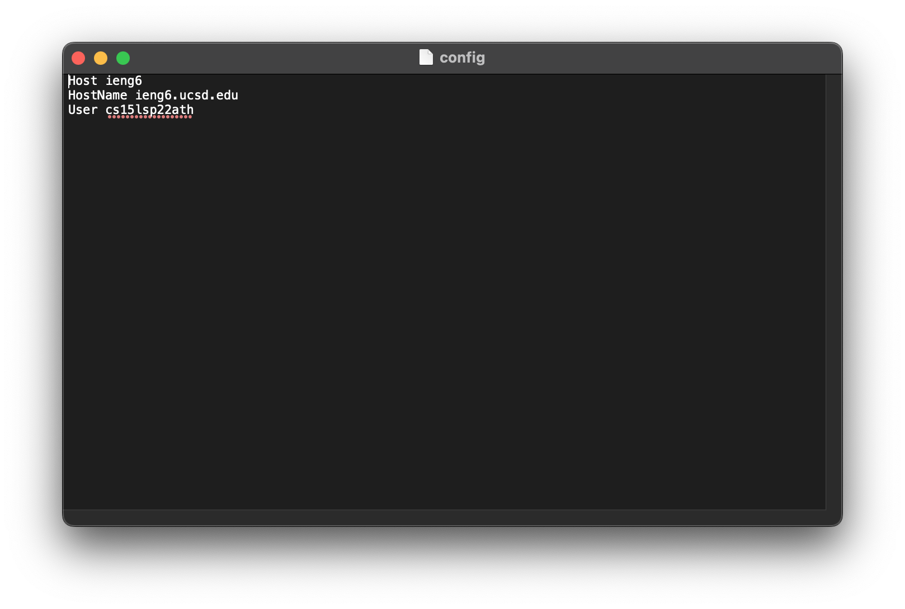
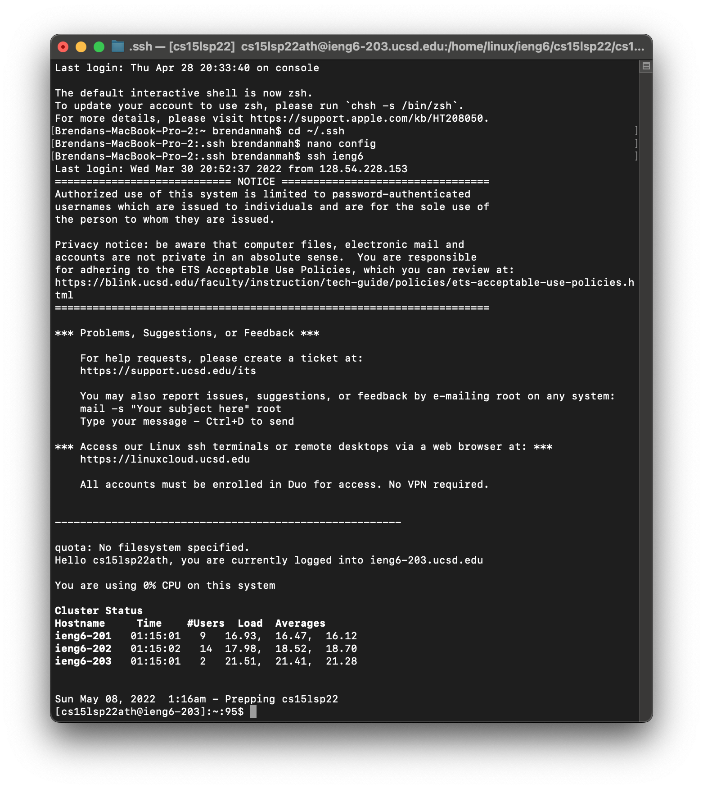
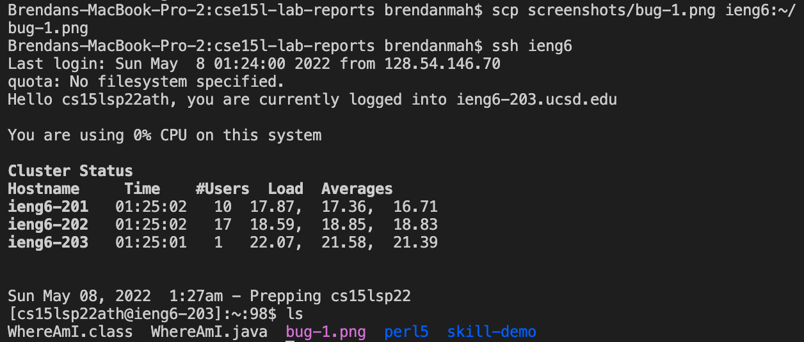
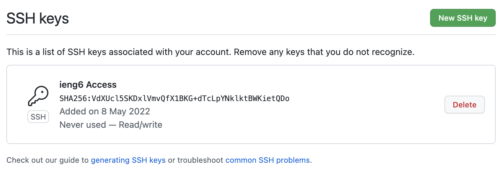
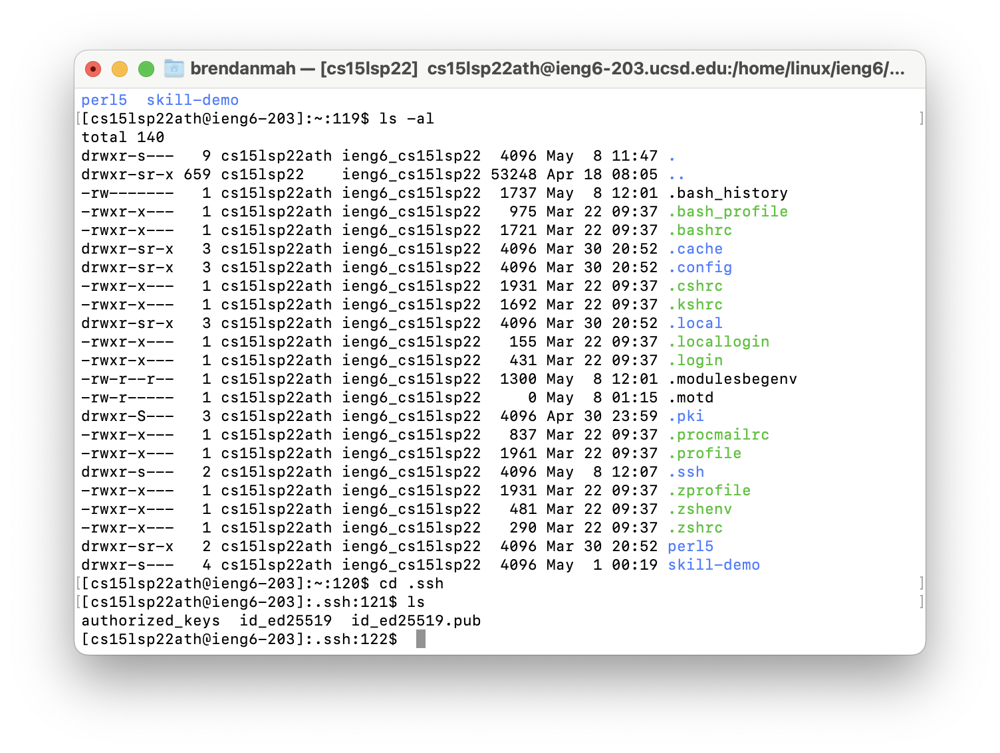
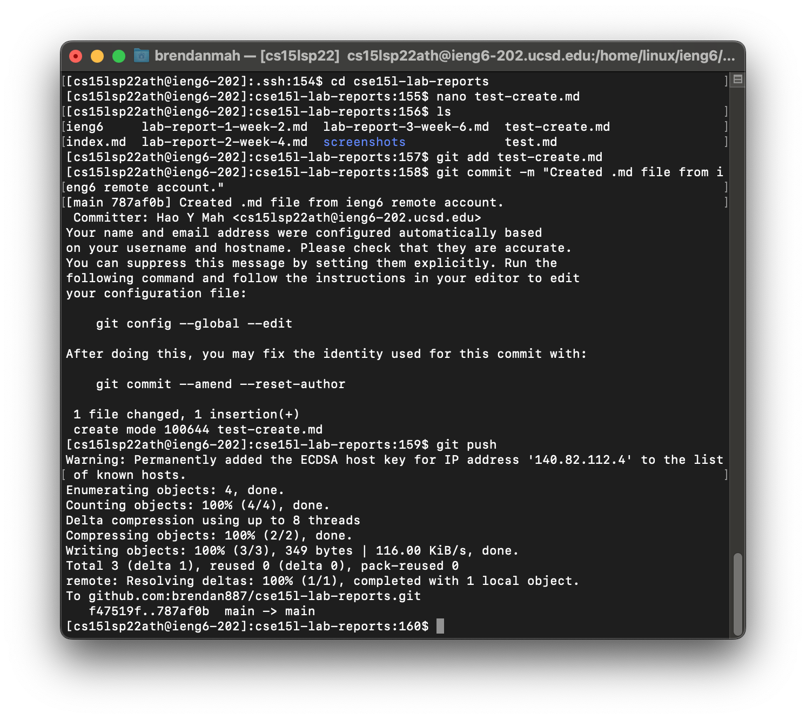
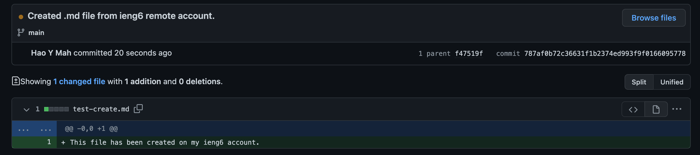
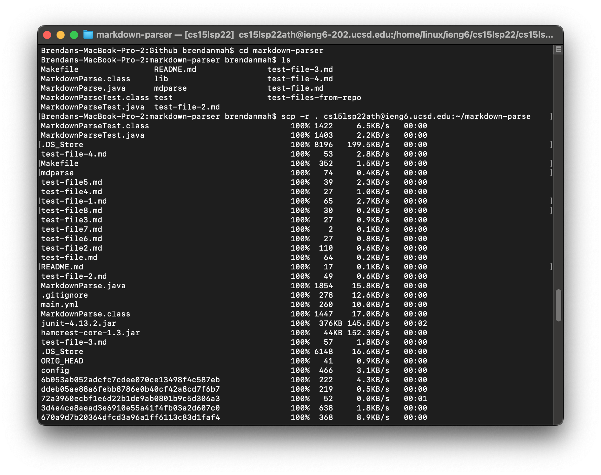
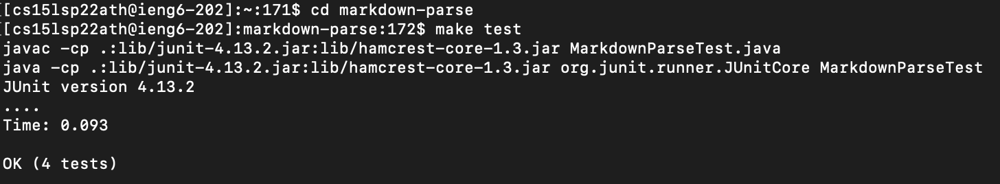
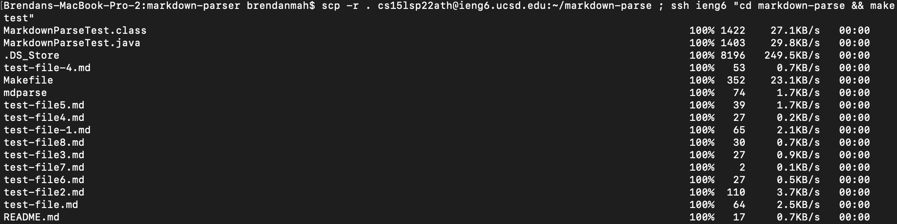

# Lab Report 3

## 1. Streamlining `ssh` Configuration
To streamline the remote access process even further, a config can be used.

This config file was created by using `cd ~/.ssh` and `nano config` in Terminal (Mac).

*This shows the creation of `config` and logging into my account using the alias `ieng6`.*

Commands such as `scp` can also be simplified by using the alias.

*`bug1.png` was successfully copied to the server by using the alias.*

## 2. Setting Up Github Access from `ieng6`
To commit and push changes to a Github repository on an remote account, an `ssh` key must be generated.

Public Key on Github:

Public and Private Keys in `ieng6` Account:

To test this key, a repository was cloned and the file `test-file.md` was created.

This file was also committed and pushed to the repository.

## 3. Copy whole directories with `scp -r`
Typically, the `scp` command only allows the user to copy individuals files. To copy an entire directory, `scp -r` can be used.

This command was used to copy the `markdown-parser` directory to the remote `ieng6` account.

The tests that were written for `MarkdownParse.java` can also be run. We can take advantage of the `Makefile` we created to compile and run the tests.

This entire process can be simplified into one command on the client desktop.

This command copies the directory, accesses the remote desktop, runs the tests, and exits.
