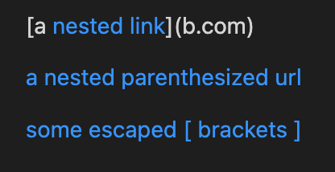
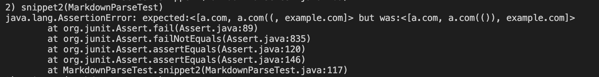

# Lab Report 4

Repositories for this lab report:

[My Repository](https://github.com/brendan887/markdown-parser)

[Reviewed Repository](https://github.com/fnriv/markdown-parser)

*The versions of Markdown Parser in these repositories can only read links. As
such, only the accuracy of getting links will be assessed.*
  
## Snippet 1
Desired Output:

The links array should be ["`google.com", "google.com", "ucsd.edu"]

Test Method:

My Repository: Test Failed

`url.com` was not considered a link because of the "`" characters which led to
a portion of the square bracket section being displayed as code instead of a
link. A fix that I can think of is to use a stack to determine when following
text is "within" a format or not. However, this would likely be a more involved fix
because it requires reading normal text and checking for various characters,
which has not been implemented in my version of MarkdownParse.

Reviewed Repository: Test Failed

  
## Snippet 2
Desired Output:

The links array should be ["a.com", "a.com(())", "example.com"]

Test Method:

My Repository: Test Failed

The error is with the link "a.com(())", which was read as "a.com((". This is
because the implementation of getLinks() searches for the next ")", at which
point it stops reading. Similar to the previous fix, a stack would likely the
best solution to determine when the link should be returned. As this is only
for within the parenthesis of links, this is a relatively simple solution (ie.
if char is ")" and stack empty, return).

Reviewed Repository: Test Failed

  
## Snippet 3
Desired Output:

The links array should be ["a.com", "a.com(())", "example.com"]

Test Method:

My Repository: Test Failed

From the test results, my version of MarkdownParse needs to be able to disregard
lines breaks in the parenthesis section of the link. In other words, the text
after the opening parenthesis do not count as a link if a closing parenthesis
does not exist on the same line. This should be a relatively easy fix, although
I am not sure how to check for line breaks, which may be more challenging
than I anticipate. Moreover, my MarkdownParse also needs to set any continuous
string (without a space in between) starting with "https://" as a link. This
fix should also not be too challenging (can be done with if statements), but
a stack will also probably need to be implemented in order to work for all cases
(like the ones reviewed in previous snippets).

Reviewed Repository: Test Failed

