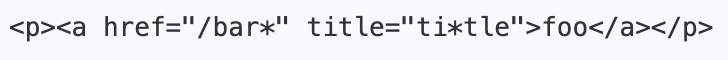

# Lab Report 5

In this lab, I compare the test file outputs of [my implementation of MarkdownParse](https://github.com/brendan887/markdown-parser) and [another one](https://github.com/nidhidhamnani/markdown-parser).

To find tests with different results, a text file was generated for each repository. The file was created using a bash for loop, which would show the name of the test file and the result. The files were then compared with `vimdiff`.

## [Test File 1](https://github.com/nidhidhamnani/markdown-parser/blob/main/test-files/22.md)

### Input
`[foo](/bar\* "ti\*tle")`

### Outputs

_Left: My implementation. Right: Other implementation_

### Expected Output

_The text is `foo` and the link is `/bar*`._

Both implementations returned the incorrect link. From the expected output, I believe that text contained in double quotes should be the `title` instead of the link of the text. To solve this bug in my implementation, a stack could be implemented to determine text contained in double quotes, and either ignore this text or store it as the `title` attribute instead. It also seems that the backward slash character is not allowed. To solve this, a for loop could be used to iterate through each link string and remove each backwarsh slash.

## [Test File 2](https://github.com/nidhidhamnani/markdown-parser/blob/main/test-files/498.md)

### Input
`[link](<foo(and(bar)>)`

### Outputs

_Left: My implementation. Right: Other implementation_

### Expected Output

_The text is `link` and the link is `foo(and(bar)`._

Both implementations returned the incorrect link. From my implementation's output and the expected output, we can see that there is a missing closing parenthesis ")". This appears to be because the entire string contained by "<>" is considered to be the link. My implementation searches for and stops at the next ")", which is why the result is incorrect. To resolve this, in the loop for getLinks(), a statement could be added to seach for "<" and, if it exists, find the next ">" and return the text in between as the link.